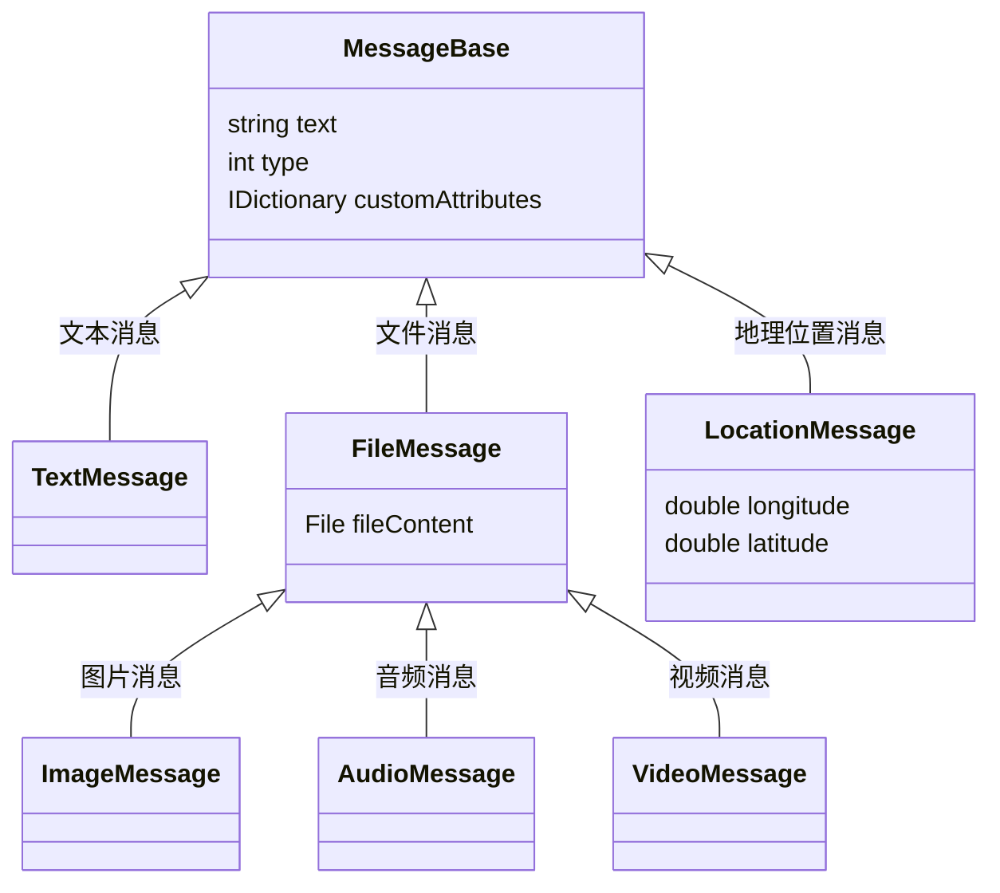
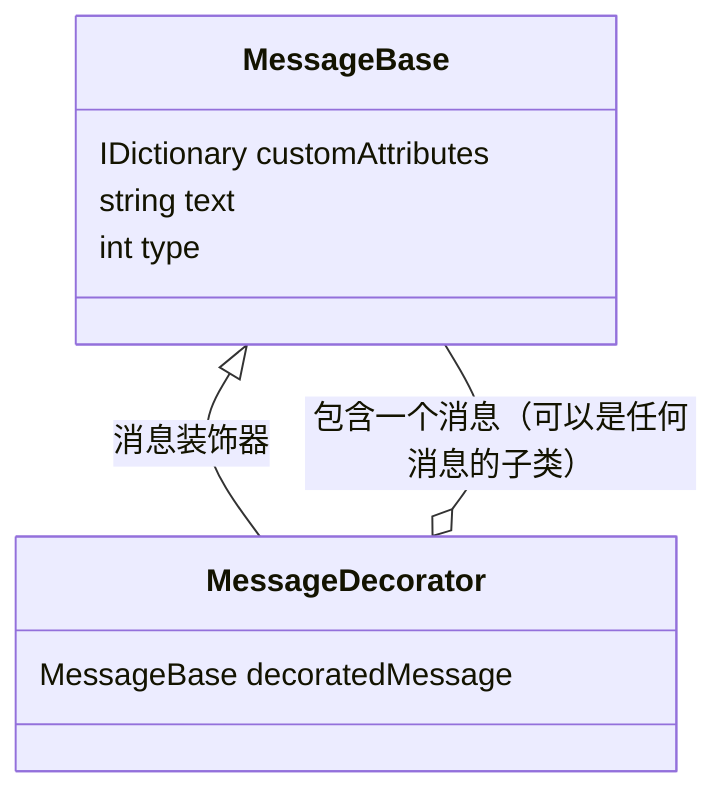
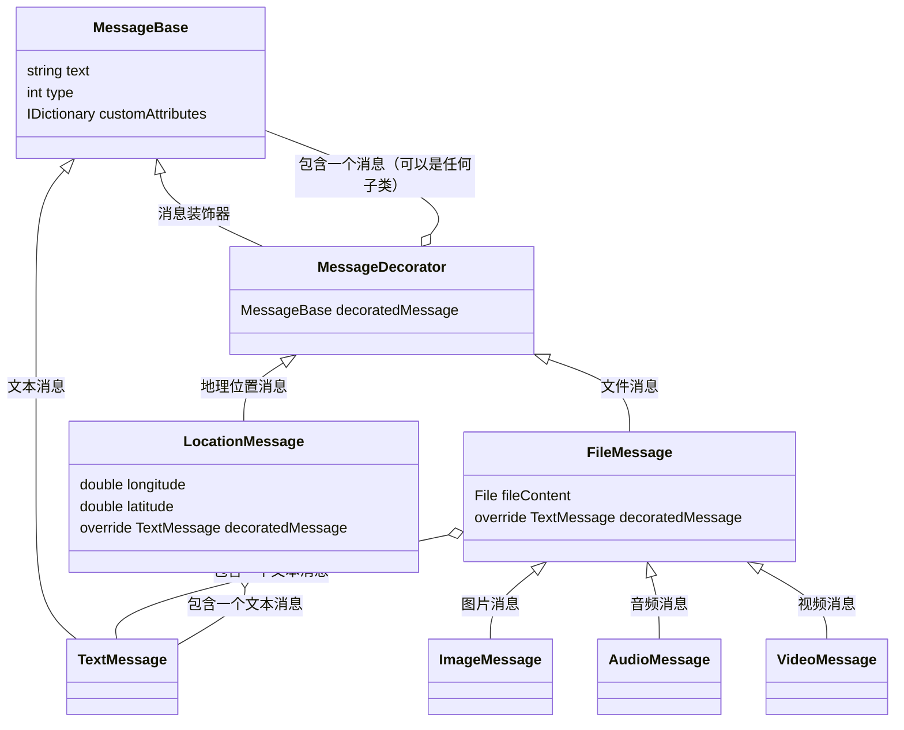

<!-- TOC -->

- [我看设计模式](#我看设计模式)
- [要解决的问题](#要解决的问题)
- [重构的驱动](#重构的驱动)
- [温故知新](#温故知新)
- [解决问题](#解决问题)
- [实例代码](#实例代码)
- [总结](#总结)

<!-- /TOC -->

## 我看设计模式

首先，我要阐述一下我的观点：

> 设计模式不是公式，也不是真理，它只是经验，如果能帮助到你重构代码，那就很好，如果只是为了使用而使用，就完全失去了意义。

我在大学三年的时候，学校教程里面包含了这门课，那个学期是我大学最稳定投入学习的一个学期，我每次交设计模式作业我都是用 Java 和 C# 的代码分别写一遍，最后选择一份可能更好的，为什么同一个设计模式下会有好坏之分呢？因为我并不是照着抄一份，而是分别定义两种场景，同一个模式下，哪边代码看上去顺眼就交上去。


## 要解决的问题

LeanCloud 的即时通讯里面内置了几种消息类型:

- `TextMessage` 文本消息
- `ImageMessage` 图像消息
- `AudioMessage` 音频消息
- `VideoMessage` 视频消息
- `FileMessage` 普通文件消息(.txt/.doc/.md 等各种)
- `LocationMessage` 地理位置消息

客户端会将他们分别编码成如下内容发送给服务端:


```json
  {
    "_lctype": -1,
    "_lctext": "这是一个纯文本消息",
    "_lcattrs": {
      "a": "_lcattrs 是用来存储用户自定义的一些键值对"
    }
  }
```
```json
{
    "_lctype": -2,
    "_lctext": "这是一个图片",
    "_lcattrs": {
      "a": "_lcattrs 是用来存储用户自定义的一些键值对"
    },
    "_lcfile": {
      "url": "http://ac-p2bpmgci.clouddn.com/246b8acc-2e12-4a9d-a255-8d17a3059d25",
      "objId": "54699d87e4b0a56c64f470a4//文件对应的AVFile.objectId",
      "metaData": {
        "name":"IMG_20141223.jepg",
        "format": "png",
        "height": 768,//单位：像素
        "width": 1024,//单位：像素
        "size": 18 //单位：b
      }
    }
  }
```
```json
  {
    "_lctype": -4,
    "_lctext": "这是一个视频消息",
    "_lcattrs": {
      "a": "_lcattrs 是用来存储用户自定义的一些键值对"
    },
    "_lcfile": {
      "url": "http://ac-p2bpmgci.clouddn.com/99de0f45-171c-4fdd-82b8-1877b29bdd12",
      "objId": "54699d87e4b0a56c64f470a4//文件对应的AVFile.objectId",
      "metaData": {
        "name":"录制的视频.mov",
        "format": "avi",
        "duration": 168,//单位：秒
        "size": 18689//单位：b
      }
    }
  }
```
```json
  {
    "_lctype": -5,
    "_lctext": "这是一个地理位置消息",
    "_lcattrs": {
      "a": "_lcattrs 是用来存储用户自定义的一些键值对"
    },
    "_lcloc": {
      "longitude": 23.2,
      "latitude": 45.2
    }
  }
```
```json
{
  "_lctype":-6,
  "_lctext":"这是一个普通文件类型",
   "_lcattrs": {
      "a": "_lcattrs 是用来存储用户自定义的一些键值对"
    },
    "_lcfile":{
    "name":"我的简历.doc",
    "size": 18689
    }
}
```

序列化出来的格式很容易让人产生如下设计：



上述的设计已经符合了需求，一般来说没有代码洁癖的话，一般不会觉得有问题。

## 重构的驱动

但是我遇到了一个问题：

> 新增一种消息类型的时候，很容易就继续走继承这条路，但是多层继承的问题就在这里，你如果只想要一个带地理位置又带图片又带二进制数据的消息类型的时候，就会抓狂。

我遇到的真实需求就是 Unity 的用户希望在游戏里面自定义更多的消息类型，比如游戏战斗的游戏里面的坐标大概也就是一个带了一张缩略图（游戏副本的题图）和一个游戏坐标（游戏中有自己的坐标系）和一个二进制的数据包（这个数据包是发送方加密过的），因此这位客户在开发的时候就疑惑了，我看你们的内置类型好像能满足我的需求，但是我应该怎样继承或者组合你们的内置类型呢？

我一开始想到的是如下结构:

```mermaid-svg
classDiagram
MessageBase <|-- BinaryCompositeMessage : 复合类型
BinaryCompositeMessage o-- ImageMessage : 包含一张图片
BinaryCompositeMessage o-- LocationMessage : 包含一张图片
MessageBase : IDictionary customAttributes
MessageBase : string text
MessageBase : int type
BinaryCompositeMessage: byte[] encipheredData : 加密二进制数据
```

但是实际上在编码的过程中，我自己都觉得恶心，因为本来序列化的时候会出现你需要将包含了的两个属性分别序列化，而他们又分别拥有一份如下属性：

```json
{
    "_lctype": *,
    "_lctext": "这是一个XX类型消息",
    "_lcattrs": {
      "a": "_lcattrs 是用来存储用户自定义的一些键值对"
}
```

而 BinaryCompositeMessage 因为是继承自 `MessageBase` 他也会拥有一份如上的数据，处理起来就特别费劲，而最费劲的不是序列化，是接收方的序列化，他需要拿到了 `_lctype` 的字段来做单独处理，这显然很让开发者头疼。

## 温故知新

从设计模式的一些经典用法中去寻找案例，来套取现在的需求。

在所有结构性的设计模式中，因为我之前在设计游戏服务端的时候，试过将连接层和业务层分离的装饰器模式，我就尝试了如下的设计：



而重新设计过的类型关系如下:




下面做一些解释：

1. `FileMessage` 和 `LocationMessage` 都继承自装饰器，并且默认都复写了父类规定的 `MessageBase` 的类型成员，默认是 `TextMessage`
2. `FileMessage`  和 `LocationMessage` 实现了装饰器，但是他并**不一定**包装了一个 `TextMessage`，因为在构造函数里面可以指定需要被包装的消息类型（甚至可以是 `LocationMessage` ）
3. `MessageDecorator` 自己的序列化和反序列化分为两个步骤，一个是先 deserialize 和 serialize 子类，然后再 deserialize 和 serialize 自己，为最后的结果附加自己的实现

## 解决问题

用上述结构我们可以设计符合当前需求的消息类型：

```mermaid-svg
classDiagram
MessageBase <|-- MessageDecorator : 消息装饰器
MessageBase <|-- TextMessage : 文本消息
MessageDecorator <|-- LocationMessage : 地理位置消息
MessageDecorator <|-- FileMessage : 文件消息
FileMessage <|-- ImageMessage :  图片消息
FileMessage <|-- AudioMessage :  音频消息
FileMessage <|-- VideoMessage :  视频消息
FileMessage o-- TextMessage : 包含一个文本消息
FileMessage o-- MessageBase : 包含一个消息（可以是任何子类）
ImageMessage <|-- BinaryCompositeMessage :  复合类型
BinaryCompositeMessage o-- LocationMessage : 装饰一个地理位置消息
MessageBase : string text
MessageBase : int type
MessageBase : IDictionary customAttributes
FileMessage : File fileContent
LocationMessage: double longitude
LocationMessage: double latitude
LocationMessage o-- TextMessage : 包含一个文本消息
MessageDecorator: MessageBase decoratedMessage
FileMessage: override TextMessage decoratedMessage 
LocationMessage: override TextMessage decoratedMessage
BinaryCompositeMessage: override LocationMessage decoratedMessage
BinaryCompositeMessage: byte[] encipheredData : 加密二进制数据
```

图解：

1. `BinaryCompositeMessage` 继承自 `ImageMessage` 然后包装了一个 `LocationMessage`，这样他就具备了图像消息和地理位置消息的两种行为和属性，最后自己再加上一个附加属性 `byte[] encipheredData` 就组成了我们要的消息类型 
2. 通过这种方式还可以构建 N 多种消息类型，并且行为在定义类的时候就属于基本可控，结构清晰，方便拓展。

## 实例代码

请参考 [leancloud/realtime-SDK-dotNET/LeanCloud.Realtime/Public/AVIMImageMessage.cs](https://github.com/leancloud/realtime-SDK-dotNET/blob/master/LeanCloud.Realtime/Public/AVIMImageMessage.cs)

## 总结

从毕业开始，每次谈到设计模式就感觉大家都不是很懂，我也没有因为我喜欢研究设计模式也自称很懂，因为这个确实是根据真实的需求要去认真思考的问题。
